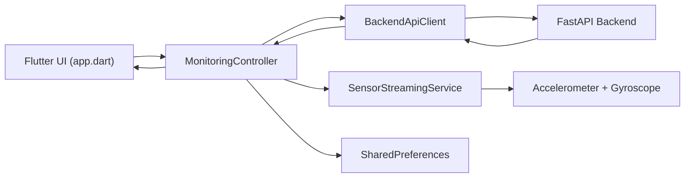
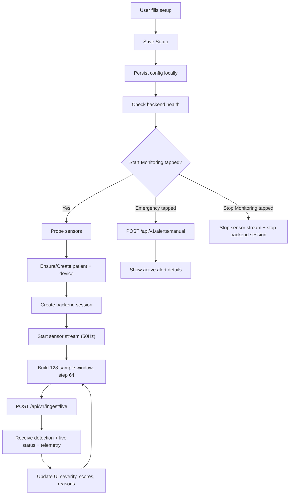

# App Frontend Analysis (`app_frontend`)

## 1. Purpose and Scope

`app_frontend` is a Flutter mobile client for live elderly monitoring.  
It acts as the **sensor capture and streaming edge app** in the system:

- collects phone accelerometer + gyroscope data
- validates backend and sensor readiness
- creates/reuses patient and device records
- starts/stops backend monitoring sessions
- streams overlapping sensor windows for live risk detection
- surfaces backend inference outputs on-device
- allows manual emergency alert trigger

This app does not run local ML inference. It streams raw motion data and renders backend predictions.

---

## 2. Tech Stack and Dependencies

- Framework: Flutter (`sdk ^3.9.0`)
- Language: Dart
- UI: Material 3
- State management: `ChangeNotifier` + `AnimatedBuilder` (no external state library)
- HTTP client: `http`
- Sensors: `sensors_plus`
- Local persistence: `shared_preferences`

Dependency config source: `app_frontend/pubspec.yaml`.

---

## 3. High-Level Architecture

Core architecture in `lib/src`:

- `app.dart`  
  UI composition, layout sections, form inputs, buttons, visual status states.

- `monitoring_controller.dart`  
  Central application state and orchestration layer:
  - setup lifecycle
  - backend reachability
  - sensor checks
  - session control
  - stream ingestion callbacks
  - emergency workflow

- `sensor_streaming_service.dart`  
  Real-time sensor buffering and sliding-window batching engine.

- `api_client.dart`  
  Backend transport abstraction for all REST calls and error normalization.

- `models.dart`  
  Shared data contracts for API request/response representations.

Entry point:
- `main.dart` -> boots app and launches `ElderlyMonitorApp`.

---

## 4. Visual Diagrams

## Architecture Diagram

## End-to-End Flow Diagram

## Feature Diagram

```mermaid
flowchart TB
    Root["Elderly Monitor Mobile App"]
    Root --> Setup["Patient Setup"]
    Setup --> Setup1["Backend URL"]
    Setup --> Setup2["Patient profile"]
    Setup --> Setup3["Device label"]
    Setup --> Setup4["Save + backend check"]

    Root --> Sensor["Sensor Access"]
    Sensor --> Sensor1["Accelerometer readiness"]
    Sensor --> Sensor2["Gyroscope readiness"]
    Sensor --> Sensor3["Last check + latest batch"]

    Root --> Session["Live Session"]
    Session --> Session1["Start/Stop monitoring"]
    Session --> Session2["Patient/Device/Session IDs"]
    Session --> Session3["Batch counters + upload timestamp"]

    Root --> Detection["Risk Detection"]
    Detection --> Detection1["Severity + message"]
    Detection --> Detection2["Risk/Fall scores"]
    Detection --> Detection3["Peak metrics + reasons"]

    Root --> Emergency["Emergency Trigger"]
    Emergency --> Emergency1["Manual SOS alert API"]
    Emergency --> Emergency2["Active alert status/details"]
```

---

## 5. App Structure and Screen Composition

The app is a **single-page scrollable operational screen** composed of function-specific cards:

1. **Hero Panel**
   - app title, profile context, live severity indicator, quick stats

2. **Banner Messages**
   - live status message
   - error banner when failures occur

3. **Patient Setup Card**
   - backend URL
   - patient name/age
   - room label
   - device label
   - setup save and backend check controls

4. **Sensor Access Card**
   - accelerometer/gyroscope readiness status
   - last checked timestamp
   - latest batch summary
   - sensor test action

5. **Live Session Card**
   - patient/device/session IDs
   - start/stop monitoring controls
   - last upload timestamp

6. **Risk Detection Card**
   - severity summary
   - backend message
   - risk/fall probability progress bars
   - features/metrics (peak acceleration, peak gyro, jerk, stillness)
   - backend-provided reasons list

7. **Emergency Trigger Card**
   - manual SOS button
   - active alert details if present

UI behavior:
- responsive two-column setup fields on wider layouts
- global busy indicator (`LinearProgressIndicator`) shown during blocking operations
- controls disabled contextually during streaming/busy phases

---

## 6. Detailed File-by-File Functional Analysis

## `lib/main.dart`

- Initializes Flutter bindings.
- Runs `ElderlyMonitorApp`.
- Keeps bootstrap minimal and clean.

---

## `lib/src/app.dart`

This file defines nearly all visual components and binds UI to controller state.

### Main App Shell
- `ElderlyMonitorApp` creates/owns `MonitoringController` unless injected.
- Calls `controller.initialize()` and shows loading screen until complete.
- Configures full theme:
  - warm neutral backgrounds
  - teal/blue gradients
  - rounded cards and form controls
  - severity-based accent language

### Home Screen
- `MonitoringHomePage` uses `AnimatedBuilder` on controller.
- Maintains text controllers for setup fields and synchronizes save/start actions.
- Main actions:
  - `Save Setup`
  - `Check Backend`
  - `Check Sensors`
  - `Start Monitoring`
  - `Stop Monitoring`
  - `Send Emergency Alert`

### Reusable UI Components
- `_HeroPanel`, `_DetectionPanel`, `_EmergencyPanel`
- `_ScorePanel`, `_MetricChip`, `_SensorStatusTile`, `_InfoRow`
- `_BannerMessage`, `_CardShell`, `_SectionHeader`

### Presentation Logic
- Severity is mapped to colors and human labels (`_severityColor`, `_severityLabel`).
- Timestamps are normalized to readable local time (`_formatTimestamp`).
- Detection metrics are displayed as percentages and fixed precision values.

---

## `lib/src/monitoring_controller.dart`

This is the app brain. It coordinates persistence, backend calls, sensor engine, and UI state.

### Internal State Domains

1. **Config state**
   - backend URL, patient profile, room, device label

2. **Identity state**
   - patient ID, device ID, active session ID

3. **Operational state**
   - busy flag, backend reachable, streaming status, status/error messages

4. **Monitoring state**
   - batches sent, last batch size/time
   - latest detection
   - live status
   - active alert
   - latest telemetry
   - sensor availability status

### Initialization

- Loads persisted setup + IDs from `SharedPreferences`.
- Applies backend URL to API client.
- Sets startup status message based on setup completeness.

### Setup Handling (`saveSetup`)

- Normalizes inputs and validates patient age (0 to 130).
- Detects setup changes:
  - patient identity changes reset patient/session and detection states
  - device changes reset device/session
- Persists setup + identifiers.
- Triggers silent backend reachability check.

### Backend Health (`refreshBackendReachability`)

- Calls health endpoint through API client.
- Updates `backendReachable`, status text, and error message.

### Sensor Availability (`refreshSensorStatus`)

- Calls sensor service probe for accelerometer + gyroscope.
- Stores status and updates UI messaging.
- Provides fallback unavailable state on probe exceptions.

### Start Monitoring Workflow (`startMonitoring`)

Strict sequence:
1. validate setup
2. verify backend reachable
3. verify required sensors available
4. ensure/create patient record
5. ensure/create device record
6. create backend session
7. reset runtime counters/states
8. start sensor service with batch callback

The flow ensures IDs and connectivity are valid before streaming begins.

### Stop Monitoring Workflow (`stopMonitoring`)

1. stop local sensor streaming
2. request backend session stop (if session exists)
3. clear session state and persist identifiers
4. handle partial-failure message if backend stop call fails

### Emergency Workflow (`triggerEmergencyAlert`)

1. ensure patient input is present
2. verify backend reachable
3. ensure patient/device records
4. call manual alert endpoint with optional session context
5. store returned active alert state

### Live Batch Callback (`_handleSensorBatch`)

Triggered by sensor service when a full window is ready.

Request payload includes:
- patient/device/session IDs
- source metadata (`flutter_mobile`)
- sample rate and units
- sample array (acc + gyro per timestamp)

On success:
- increments batch counters
- updates detection, live status, telemetry, and active alert
- marks backend reachable and updates status message

On failure:
- marks backend unreachable
- keeps streaming active
- records error and reports upload failure state

This behavior is resilient: a failed upload does not instantly terminate local capture.

---

## `lib/src/sensor_streaming_service.dart`

Implements sensor data capture and windowed batching strategy.

### Core parameters
- target sampling rate: `50 Hz`
- window size: `128` samples
- step size: `64` samples

This creates overlapping windows (50% overlap), which improves temporal continuity for backend detectors.

### Runtime behavior

- subscribes to gyro and accel streams
- continuously caches latest gyroscope values
- each accel tick:
  - enforces min time gap (sampling throttling)
  - composes unified reading (acc + latest gyro + timestamp)
  - appends to buffer
- when buffer reaches window size:
  - flushes window asynchronously
  - removes `stepSize` samples
  - recursively flushes again if enough buffered samples remain

### Sensor probing

- `probeSensors()` checks both streams with timeout-based first-event detection.
- returns availability booleans with check timestamp.

This service cleanly separates sensor concerns from UI/business logic.

---

## `lib/src/api_client.dart`

Backend transport layer with consistent error handling.

### Capabilities
- base URL normalization (auto add scheme, strip trailing slash)
- timeout handling (`8s`)
- JSON decode + HTTP status validation
- meaningful user-facing API exceptions

### Endpoints used

- `GET /api/v1/health` -> `ping`
- `POST /api/v1/patients` -> create patient
- `GET /api/v1/patients/{id}` -> verify existing patient
- `POST /api/v1/devices` -> create device
- `GET /api/v1/devices/{id}` -> verify existing device
- `POST /api/v1/sessions` -> start monitoring session
- `POST /api/v1/sessions/{id}/stop` -> stop session
- `POST /api/v1/ingest/live` -> upload sensor batch for inference
- `POST /api/v1/alerts/manual` -> emergency manual alert

### Payload conventions
- sample source tagged as `flutter_mobile`
- units explicitly included (`m_s2`, `rad_s`)
- ingestion payload ships full sample arrays from the sliding window

---

## `lib/src/models.dart`

Defines app-side schemas for all API objects:

- infrastructure/entity models:
  - `PatientRecord`, `DeviceRecord`, `SessionRecord`
- inference/monitoring models:
  - `DetectionResultModel`, `LiveStatusModel`
  - `TelemetrySnapshotModel`, `SensorReadingPayload`
  - `IngestResponseModel`
- alert/sensor utility models:
  - `AlertRecordModel`, `SensorAccessStatus`
- `ApiException` for transport/domain error reporting

Benefits:
- strong typing for decoding backend responses
- centralized serialization/deserialization rules
- safer UI rendering with defaults for missing fields

---

## 7. App Functional Flows (End-to-End)

## Setup flow
- user fills backend URL + patient/device details
- app validates and persists locally
- app checks backend health

## Sensor validation flow
- app probes accelerometer + gyroscope
- UI reports per-sensor availability and timestamp

## Monitoring flow
- create/reuse patient + device
- start backend session
- stream overlapping batches continuously
- receive detection + live status each ingest response
- render realtime severity and metrics

## Emergency flow
- send manual alert with patient and optional session linkage
- display active alert metadata

---

## 8. UI/UX Characteristics

- **Single operational page:** minimizes navigation friction for caregiver/operator use.
- **Status-first design:** banners and hero stats communicate readiness quickly.
- **Safety-oriented controls:** disabled states prevent invalid actions while busy/streaming.
- **Readable clinical style:** large cards, high contrast labels, explicit severity coloring.
- **Progressive transparency:** users see not only severity but also underlying metrics/reasons.

---

## 9. Sensor and Streaming Strategy Rationale

Why this strategy is likely used:

- `50 Hz` target rate is practical for mobile motion monitoring.
- `128` sample windows are large enough for short motion episodes.
- `64` step overlap preserves temporal continuity and reduces blind spots.
- window-based uploads simplify backend feature extraction and model serving consistency.

Why not stream every raw event individually:
- higher request overhead
- less stable inference context per call
- harder backend feature engineering for sequence-level features

---

## 10. AI/ML in the App

Direct on-device model inference: **none**.

The app’s AI role is:
- sensor data acquisition and preprocessing at transport level (windowing/sampling, not feature extraction)
- sending inference-ready sensor sequences
- rendering backend outputs:
  - severity
  - risk score
  - fall probability
  - detector reasons
  - derived motion metrics

Model training, feature engineering, and evaluation happen outside this app (backend/pipeline domain).

---

## 11. Strengths, Risks, and Improvement Opportunities

## Strengths
- clear separation between UI, orchestration, transport, and sensors
- robust local persistence and identity reuse behavior
- safe lifecycle handling for start/stop operations
- resilient streaming loop (batch failures do not instantly kill session)
- rich operator-facing risk feedback

## Risks / Gaps
- no auth/token handling in mobile API layer
- single-page file (`app.dart`) is large and should be modularized further
- no offline queue/retry for failed batch uploads
- no background service support noted for locked-screen/background capture scenarios

## Suggested improvements
1. split `app.dart` into feature widgets/files for maintainability
2. add retry buffer for failed batch uploads (bounded queue)
3. introduce auth and per-user session security
4. add richer telemetry trend visuals in-app
5. add integration tests for controller workflows and ingest error recovery

---

## 12. Quick Functionality Inventory

- setup persistence (backend + patient + device)
- backend health checks
- sensor availability checks
- patient/device creation and reuse
- monitoring session start/stop
- real-time windowed sensor ingestion
- live detection/result visualization
- manual emergency alert triggering
- operational status/error messaging

