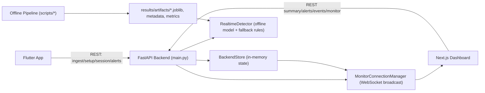
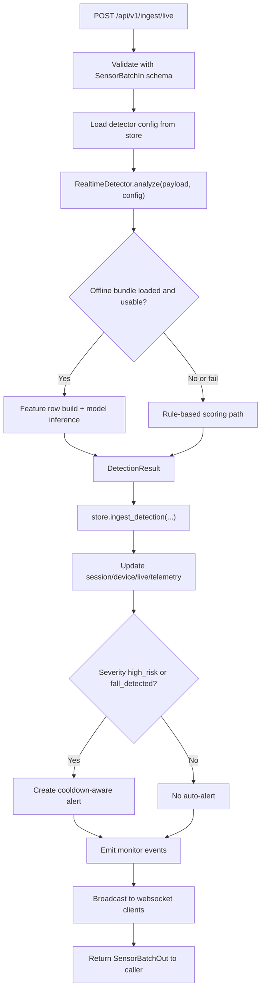
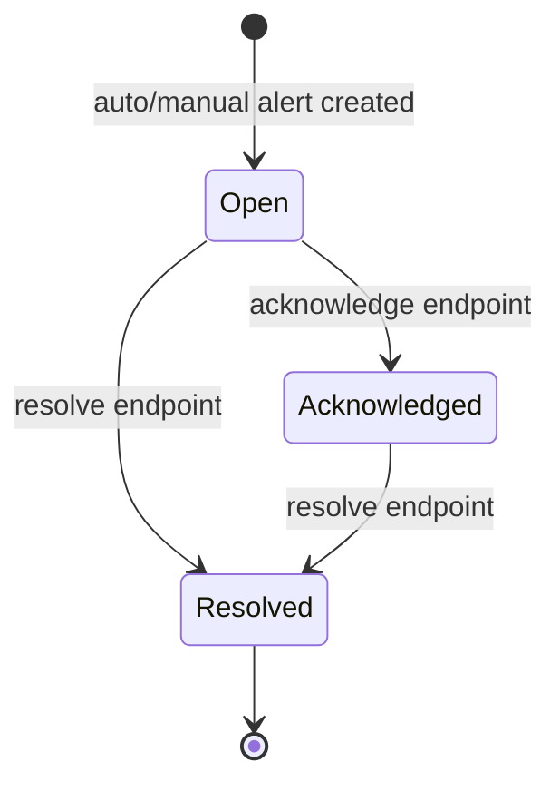
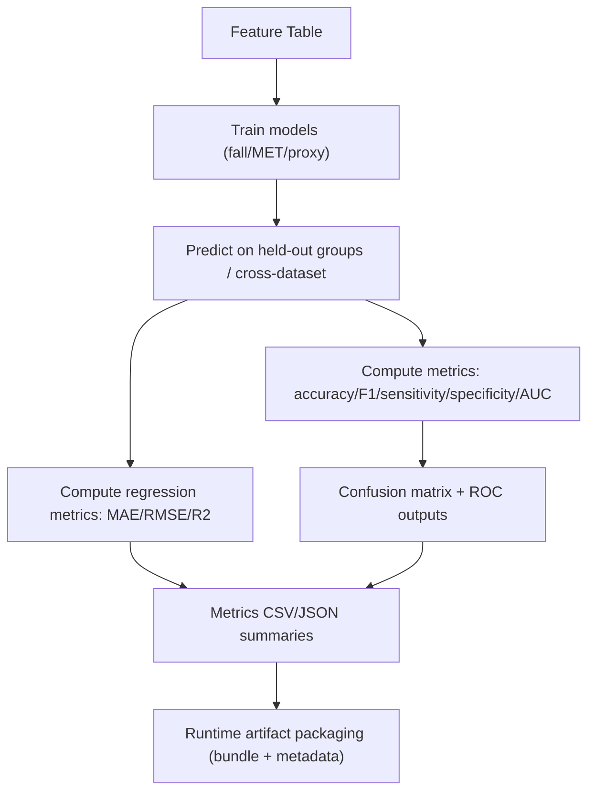

# Backend Analysis (Runtime + ML Pipeline)

## 1. Scope

This document covers the full backend domain requested:

- Runtime API backend in `flask_backend/app`
- Operational tooling in `flask_backend/scripts`
- Offline ML/data pipeline in `scripts`
- Model usage in production runtime
- Preprocessing and why these steps are used
- Evaluation techniques and reporting
- Full route and feature behavior mapping

---

## 2. System Architecture (High-Level)

---

## 3. Backend Runtime Structure

Primary runtime files:

- `flask_backend/app/main.py`: API app creation, middleware, exception handlers, all REST + websocket routes.
- `flask_backend/app/store.py`: in-memory transactional state and domain workflows.
- `flask_backend/app/detection.py`: realtime detection engine (offline-trained model if available, else rule-based fallback).
- `flask_backend/app/schemas.py`: strict request/response contracts and enums.
- `flask_backend/app/realtime.py`: websocket connection manager + broadcast logic.
- `flask_backend/app/config.py`: env-driven settings.

Deployment/runtime support:

- `flask_backend/Dockerfile`
- `flask_backend/captain-definition`
- `flask_backend/scripts/stress_test.py`

---

## 4. Route Inventory (What Exists and What Each Does)

## System and root

- `GET /`  
  Service metadata entry point.

- `GET /api/v1/health`  
  Liveness + app identity timestamp.

- `GET /api/v1/summary`  
  Counts for patients/devices/sessions/alerts + last event timestamp.

## Events and detector control

- `GET /api/v1/events/recent`  
  Recent operational event feed.

- `GET /api/v1/detector/config`  
  Returns active detector thresholds/config.

- `PUT /api/v1/detector/config`  
  Partially updates detector config and emits a realtime config-updated event.

- `GET /api/v1/detector/status`  
  Runtime mode status (offline model loaded vs rule-based fallback), artifact paths, reason.

## Patients

- `POST /api/v1/patients`  
  Create patient record + initialize live status shell + emit `patient.created`.

- `GET /api/v1/patients`  
  List all patients.

- `GET /api/v1/patients/{patient_id}`  
  Get one patient.

## Devices

- `POST /api/v1/devices`  
  Create device + emit `device.created`.

- `GET /api/v1/devices`  
  List devices.

- `GET /api/v1/devices/{device_id}`  
  Get one device.

## Sessions

- `POST /api/v1/sessions`  
  Start session for patient+device (enforces one active session per patient/device pair) + emit session and live updates.

- `GET /api/v1/sessions?active_only=bool`  
  List all or only active sessions.

- `GET /api/v1/sessions/{session_id}`  
  Get one session.

- `POST /api/v1/sessions/{session_id}/stop`  
  Stop session, close live linkage, emit updates.

## Monitoring and telemetry

- `GET /api/v1/monitor/patients/live`  
  List all live patient statuses.

- `GET /api/v1/monitor/patients/{patient_id}/live`  
  Get one patient’s live status.

- `GET /api/v1/monitor/telemetry/recent?limit=1..100`  
  Most recent telemetry snapshots.

- `GET /api/v1/monitor/patients/{patient_id}/telemetry`  
  Latest telemetry for one patient.

## Ingestion and inference

- `POST /api/v1/ingest/live`  
  Main realtime path: validates payload -> runs detector -> updates store -> may create alert -> emits events -> returns detection/live/telemetry bundle.

## Alerts

- `GET /api/v1/alerts?status=&patient_id=`  
  Query alerts with optional filters.

- `POST /api/v1/alerts/manual`  
  Manual emergency alert creation.

- `POST /api/v1/alerts/{alert_id}/acknowledge`  
  Mark alert as acknowledged.

- `POST /api/v1/alerts/{alert_id}/resolve`  
  Mark alert as resolved.

## Realtime channel

- `WS /ws/monitor`  
  Client receives emitted `MonitorEvent` stream (`telemetry.ingested`, `detection.updated`, `alert.*`, `session.*`, etc.).

---

## 5. Ingestion + Detection Runtime Flow

---

## 6. File-by-File Detailed Runtime Analysis

## `flask_backend/app/main.py`

Core responsibilities:

- constructs FastAPI app and wires CORS
- request metadata middleware:
  - request id (`X-Request-Id`)
  - request processing time (`X-Process-Time-Ms`)
- startup detector status logging (offline model mode vs fallback reason)
- centralized exception handling:
  - validation errors (422)
  - domain errors (400)
  - HTTP errors
  - uncaught internal errors (500)
- registers all REST and websocket routes
- orchestrates event broadcasts after store mutations

Design observations:
- route handlers are thin and delegate domain logic to `store` and `detector` (good separation).
- app uses global singleton instances (`store`, `detector`, `monitor_manager`) for process-local shared state.

---

## `flask_backend/app/store.py`

This is the domain state engine with async lock protection.

State domains:

- entities: patients/devices/sessions/alerts
- operational views: live status, telemetry snapshots
- event log: bounded deque
- detector config: mutable thresholds

Critical behaviors:

- session integrity checks:
  - patient and device must exist
  - disallow conflicting active sessions
- ingest integrity checks:
  - patient/device/session must exist
  - session must be active
  - session must match patient-device pair
- telemetry snapshots:
  - keeps last patient snapshot + recent list
- auto-alert logic:
  - only for `high_risk` and `fall_detected`
  - cooldown window avoids repeated duplicate alert storms
- alert lifecycle:
  - open -> acknowledged -> resolved
  - live status active-alert IDs maintained

This module performs the real transactional behavior of the backend.

---

## `flask_backend/app/detection.py`

`RealtimeDetector` supports two modes:

1. **Offline model mode (preferred)**  
   Loads `fall_detector_bundle.joblib` (or legacy model + metadata) from artifacts.

2. **Rule-based mode (fallback)**  
   Used when artifacts/dependencies are missing or inference fails.

Key logic:

- unit normalization:
  - acceleration `m_s2 -> g`
  - gyroscope `rad_s -> dps`
- feature primitives computed per batch:
  - acceleration magnitude peaks
  - gyroscope magnitude peaks
  - jerk peak
  - tail stillness ratio
- offline mode:
  - resamples batch to expected window length if needed
  - uses `build_single_feature_row` from `scripts/feature_extraction.py`
  - aligns to training-time feature column order
  - predicts fall probability from trained model
- severity mapping:
  - probability/score mapped by configurable thresholds (`medium`, `high_risk`, `fall_detected`)

Why this design:
- keeps runtime robust (graceful fallback)
- keeps API contract stable while model can evolve offline
- allows hot artifact replacement without route changes

---

## `flask_backend/app/schemas.py`

Provides strict API contract safety:

- `extra="forbid"` on mutable input models to prevent silent payload drift
- numeric limits on sensor and config values
- string stripping/blank guards for identifiers and actors
- monotonic timestamp check for sensor samples
- enum constraints for status/severity/units

This is critical for production reliability and predictable ingestion behavior.

---

## `flask_backend/app/realtime.py`

Simple but effective websocket fanout manager:

- connection set with lock-protected mutation
- accepts/removes websocket clients
- broadcasts JSON-encoded `MonitorEvent`
- cleans stale sockets on send failures

Purpose:
- powers dashboard near-realtime updates without polling-only UX.

---

## `flask_backend/app/config.py`

Environment-driven config abstraction:

- app name
- API prefix
- debug mode
- CORS origins
- recent event limit
- offline artifact path

Gives deployment flexibility without code edits.

---

## 7. Feature Diagram (Runtime Capabilities)

```mermaid
flowchart TB
    Root["Backend Runtime Features"]
    Root --> Entity["Entity Management"]
    Entity --> Entity1["Patients CRUD-lite"]
    Entity --> Entity2["Devices CRUD-lite"]
    Entity --> Entity3["Sessions start/stop/query"]

    Root --> Ingest["Realtime Ingestion"]
    Ingest --> Ingest1["Schema validation"]
    Ingest --> Ingest2["Detector inference"]
    Ingest --> Ingest3["Live status + telemetry updates"]

    Root --> Alert["Alerting"]
    Alert --> Alert1["Auto alerts from detection severity"]
    Alert --> Alert2["Manual emergency alerts"]
    Alert --> Alert3["Acknowledge / resolve workflow"]

    Root --> Observe["Observability"]
    Observe --> Observe1["Recent event feed"]
    Observe --> Observe2["System summary"]
    Observe --> Observe3["WebSocket monitor stream"]

    Root --> Control["Detector Control"]
    Control --> Control1["Live config update API"]
    Control --> Control2["Runtime status + mode introspection"]
```

---

## 8. Data Validation and Error Strategy

Validation strategy:

- Pydantic constraints for field ranges and required structures
- schema-level invariants (e.g., monotonic timestamps)
- unknown field rejection (`extra=forbid`)

Error strategy:

- structured error payload (`code`, `message`, `trace_id`, `timestamp`, `details`)
- consistent conversion of domain `ValueError` to 400
- HTTP exceptions preserved with structured wrapper
- global 500 handler with server-side log

Operational diagnostics:

- request id propagation
- per-request timing header

---

## 9. Alert Lifecycle Diagram

---

## 10. Offline ML Pipeline (`scripts/`) - End-to-End

Pipeline modules:

- `preprocessing.py`
- `feature_extraction.py`
- `modeling.py`
- `evaluation.py`
- `run_pipeline.py`
- `app_integration.py`
- plus analysis/report scripts (`comparison_study.py`, `report_generation.py`, `temporal_modeling.py`)

```mermaid
flowchart LR
    Datasets["SisFall + MobiAct + UCI"] --> Prep["preprocessing.py"]
    Prep --> Windows["Windowed signals (50Hz, 2.56s, 50% overlap)"]
    Windows --> FE["feature_extraction.py"]
    FE --> Features["Engineered feature table + proxy targets"]
    Features --> Train["modeling.py"]
    Train --> Artifacts["joblib models + runtime bundle + metrics + plots"]
    Artifacts --> Runtime["flask_backend/app/detection.py loads bundle"]
```

---

## 11. Preprocessing in Detail (What and Why)

## What preprocessing does

From `scripts/preprocessing.py`:

- harmonizes multiple datasets (SisFall, MobiAct, UCI HAR)
- converts raw units/formats into common signal representation
- low-pass filter (Butterworth, 20 Hz cutoff)
- resamples to common target rate (50 Hz)
- computes acceleration and gyro magnitudes
- creates fixed-length overlapping windows:
  - window duration: 2.56 s
  - overlap: 50%
  - effective default size at 50 Hz: 128 samples
  - step: 64 samples
- labels windows with task metadata (fall, MET class, age group, subject, dataset)

## Why these choices (rationale)

- **50 Hz target**: practical balance between motion fidelity and mobile/backend cost.
- **Low-pass 20 Hz**: removes high-frequency sensor noise while retaining human movement dynamics.
- **Windowing (2.56 s)**: captures enough temporal context for impact + recovery patterns.
- **50% overlap**: improves continuity and reduces boundary misses around fall transitions.
- **Unified unit/shape space**: essential for cross-dataset training and reusable runtime inference.

## Why not alternatives

- no-window streaming would reduce temporal context and destabilize classifier features.
- much higher sample rates increase compute/power/network cost with limited incremental benefit.
- no overlap increases risk of split-event windows and misses around event boundaries.

---

## 12. Feature Engineering in Detail

From `scripts/feature_extraction.py`:

Feature families include:

- time-domain stats (mean/std/var/RMS/IQR/skew/kurtosis/ZCR/jerk RMS)
- frequency-domain stats (Welch spectral energy, entropy, dominant freq, band energies)
- entropy features (approximate entropy, sample entropy, wavelet entropy)
- gait-style metrics (step intervals, autocorr peak, harmonic ratio)
- proxy features:
  - tremor band energy (4–6 Hz)
  - bradykinesia/asymmetry proxies
  - frailty/gait stability/movement-disorder proxy scores

Why this design:

- combines impact signature, periodic gait behavior, and signal complexity
- supports both binary fall detection and broader multi-task mobility health outputs
- creates interpretable metrics used in app/dashboard messaging

---

## 13. Model Training and Runtime Model Use

## Training (`scripts/modeling.py`)

Main trained tasks:

- fall detection:
  - `BalancedRandomForestClassifier` (handles class imbalance explicitly)
  - cross-dataset and group-aware split behavior
- MET classification:
  - `RandomForestClassifier` with balanced subsampling
- proxy regression:
  - `GradientBoostingRegressor` wrapped by `MultiOutputRegressor`

Saved artifacts:

- `fall_detector.joblib`
- `fall_detector_bundle.joblib` (runtime bundle with model + feature columns + window params)
- metadata JSON + charts + metrics outputs

## Runtime use (`flask_backend/app/detection.py`)

At runtime:

1. detector tries loading bundle from artifact dir
2. if available, builds aligned feature vector from live payload
3. predicts probability
4. maps to severity thresholds from live config
5. if inference fails/unavailable, falls back to rule-based logic

Why this hybrid runtime is good:

- resilient under missing artifacts/dependencies
- supports gradual rollout from heuristics to ML
- no API-level change needed when model improves

---

## 14. Evaluation Techniques Used

## Evaluation utilities (`scripts/evaluation.py`)

Classification metrics:

- accuracy
- F1
- sensitivity (recall for fall class)
- specificity (recall for non-fall class)
- ROC-AUC (when probabilities available)

Regression metrics:

- MAE
- RMSE
- R2

Artifacts generated:

- confusion matrix images
- ROC curves
- CSV summary reports

## Training/evaluation protocol details (`scripts/modeling.py`)

- group-aware subject split via `GroupShuffleSplit` (reduces subject leakage risk)
- additional SisFall LOSO-style checks via `GroupKFold` for robustness
- class imbalance handling using `BalancedRandomForestClassifier`

## Operational performance evaluation (`flask_backend/scripts/stress_test.py`)

- load-test on `/api/v1/ingest/live`
- reports throughput, p50/p95/p99 latency, status code distribution, sample errors
- outputs JSON + Markdown reports

---

## 15. Evaluation Flow Diagram

---

## 16. Additional Backend Tooling

- `flask_backend/scripts/stress_test.py`: API load/performance testing.
- `scripts/run_pipeline.py`: end-to-end orchestration, skip-if-artifact-exists behavior.
- `scripts/app_integration.py`: export placeholders and mobile integration notes.
- `scripts/report_generation.py`: synthesizes analysis artifacts into comprehensive report.
- `scripts/comparison_study.py`: compares evaluation outputs across model runs.

---

## 17. Important Observations and Practical Risks

## Strengths

- clean separation: API orchestration vs state engine vs detector engine
- strict schema validation and consistent error envelope
- robust fallback from model inference to rules
- realtime event architecture supports both web and app observability
- explicit operational tooling (stress testing + metrics artifacts)

## Risks / caveats

- in-memory store: state resets on process restart, no horizontal scaling persistence.
- websocket requires client keepalive behavior; server currently expects incoming text loop.
- model dependency coupling: runtime imports offline feature code path.
- some research scripts appear partially divergent from current artifact formats (`temporal_modeling.py` expects metadata layout not produced by current preprocessing output format), so treat those scripts as experimental unless validated.

---

## 18. Recommended Next Backend Steps

1. move `BackendStore` to persistent DB-backed repository layer (Postgres/Redis as needed).
2. add authentication/authorization for alert and session operations.
3. add versioned model registry metadata and explicit model version in detector status/output.
4. introduce async queue/retry for ingestion bursts and backpressure control.
5. add integration tests for ingestion + alert cooldown + websocket event contracts.

---

## 19. Quick Backend Functionality Checklist

- patient/device/session management
- live sensor ingestion and detection
- hybrid ML/rule-based risk scoring
- telemetry snapshots and live status
- auto alerting + manual emergency alerts
- alert acknowledgement/resolution lifecycle
- detector config runtime tuning
- system summary and recent event feed
- websocket realtime broadcast for monitoring dashboard
- offline data preprocessing, feature engineering, model training, and evaluation

